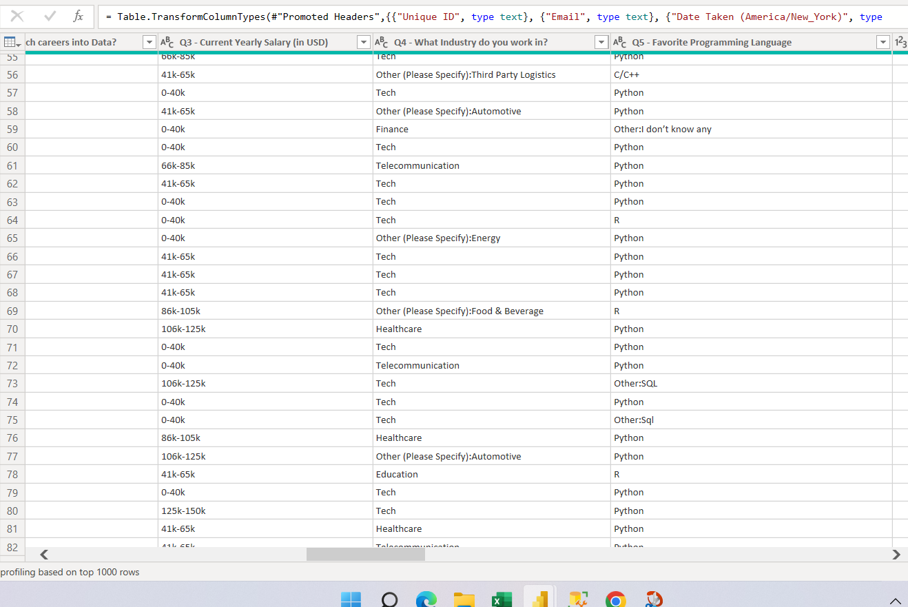
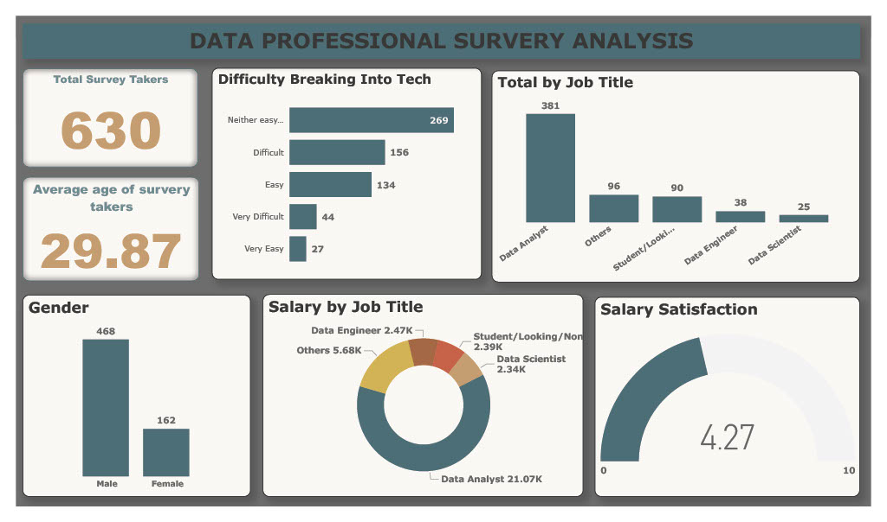
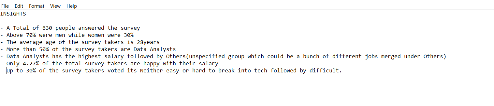

# Data-Professional-Survey-Analysis
This is a power bi project to Analyse a survey taken by data professionals to understand the characteristics and gain a little insight into their world.

### SKILLED SHOWN

- DATA CLEANING
- DAX
- VISUALIZATION
- POWER BI
  
### STEPS TAKEN 

- DATA IMPORTATION - I used the csv data source to import the data into power bi.
- DATA INSPECTION
- DATA CLEANING - I proceeded to power bi to GO through my data one more time to be sure its ready to be worked with and their wasnt much cleaning to be done apart from correcting data types and fixing u some columns like the one below

I didnt how the data looked so i proceeded to prepare it for use
- Tried doing that with power query but i was confused on what to do as all the available options i thought about floped, Yeah i was in a delima either i replace all the columns with others and worked with it or i fixed it up to an extent, I eventually had to go back to excel and used formulars to do the work.
- I first of all replaced all unnecessary data within the columns with NOTHING,
- Then i used the IF COUNTIF function to count and group the ones with less than 10 mentions as Others.

- VISUALISATION -Visualized the data and put the dashboard together.

## VISUALIZATION

## INSIGHTS

THANK YOU. 🙂
